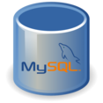
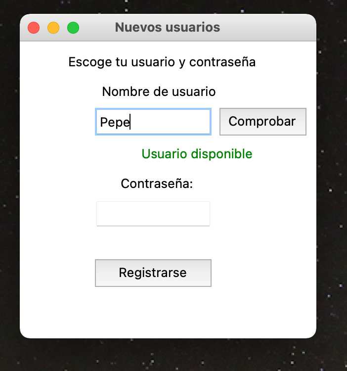
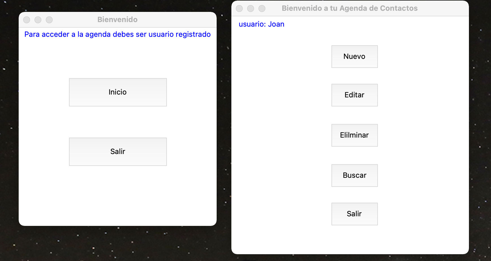

# Proyecto_agenda :rocket:

Este es mi primer proyecto como programador y el resultado del Bootcamp Programación desde Cero realizado con los amigos de [GeeksHubsAcademy](https://geekshubsacademy.com/).

He utilizado los conocimientos adquiridos en Python y en manejo de base de datos. Para la interface gráfica he utilizado la librería de python Tkinter.

 

Se trata de una agenda de contactos personal conectada a una base de datos remota que permite almacenar todos los registros.
El funcionamiento es el siguiente:
* Ventana de inicio.
* Ventana de registro de usuario.
* Ventana para loguearse.

* Ventana con el menú de opciones de la agenda:
    * Agregar contacto.
    * Editar contacto.
    * Buscar contacto.
    * Eliminar contacto.

Para el almacenamiento de los datos del login de usuarios he utilizado el algoritmo de encriptado Sha256.
Para el servicio de bases de datos en remoto he utilizado los servicios de [Clever Cloud](https://www.clever-cloud.com/en/).

Espero que os guste.:smile:!
